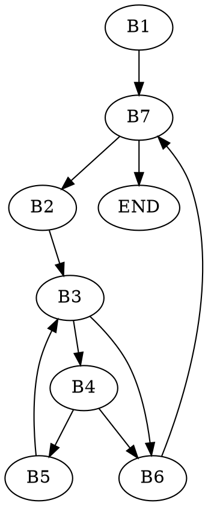

# ASK 2021 - Lista 1
## 1
```c=
// 
// L (skopiowany bit z i-itej pozycji przeniesiony na k-tą)
// P (x z wyzerowanym k-tym bitem)
(((x >> i) & 1) << k) | (x & ~(1 << k));
```
## 2
```c=
#include <stdio.h>
#include <stdint.h>

int main() {
    uint32_t x;
    
    const uint32_t mask1  = 0x55555555; // 01010101010101010101010101010101
    const uint32_t mask2  = 0x33333333; // 00110011001100110011001100110011
    const uint32_t mask4  = 0x0f0f0f0f; // 00001111000011110000111100001111
    const uint32_t mask8  = 0x00ff00ff; // 00000000111111110000000011111111
    const uint32_t mask16 = 0x0000ffff; // 00000000000000001111111111111111

    x = 255;
    
    x = (x & mask1 ) + ((x >>  1) & mask1 );  // ile jest zapalonych bitów na 2 bitach
    x = (x & mask2 ) + ((x >>  2) & mask2 );  // ile jest zapalonych bitów na 4 bitach
    x = (x & mask4 ) + ((x >>  4) & mask4 ); 
    x = (x & mask8 ) + ((x >>  8) & mask8 ); 
    x = (x & mask16) + ((x >> 16) & mask16);  // ile jest zapalonych bitów  32 bitach
    printf("%d", x);
}
```
## 3
```c=
// '-': padding
// rozmiar struktury to wielokrotność rozmiaru największego typu wewnątrz

// a---bbbbc-dd = 12B
struct A {
    int8_t a;     // 1B
    void *b;      // 4B
    int8_t c;     // 1B
    int16_t d;    // 2B    
};

// bbbbddac czyli 8B
struct A_fix {
    void *b;      // 4B
    int16_t d;    // 2B
    int8_t a;     // 1B
    int8_t c;     // 1B    
};

// aa------bbbbbbbbcccc---- = 24B
struct B {
    uint16_t a;   // 2B
    double b;     // 8B
    void *c;      // 4B 
};
// bbbbbbbbccccaa-- = 16B
struct B_fix {
    double b;     // 8B
    void *c;      // 4B
    uint16_t a;   // 2B    
};

printf("%ld\n", sizeof(struct A));
printf("%ld\n", sizeof(struct A_fix));
printf("%ld\n", sizeof(struct B));
printf("%ld\n", sizeof(struct B_fix));
```
## 4
volatile:
- zmienna ze słowem kluczowym volatile jest zawsze odczytywana z pamięci
- powtrzymuje to optymalizację kompilatora jeśli zmienna nie wygląda na zmienioną

przydatne jeśli:
- jest to zmienna globalna używana przez wiele wątków
- zmienna jest rejestrem/interfejsem sprzętowym

static:
- zmienne globalne i funkcje ze słowem kluczowym static są prywatne w obrębie obecnego modułu, unikamy kolizji nazw
- zmienne lokalne - sprawia, że zmienna ma tylko jedną instancję w programie

restrict:
- gwarantuje że dostęp do obiektu wskazywanego przez wskaźnik ze słowym kluczowym restrict będzie możliwy tylko przez ten konkretny wskaźnik

## 5
```c=
s += b[j+1] + b[--j];
```
```
t1 := j + 1
t2 := t1 * 4
t3 := b[t2]      // t3 := b[j + 1], t := b + (j+1)*4; t3 := *t
j  := j - 1
t4 := j * 4
t5 := b[t4]      // t5 = b[--j]
t6 := t3 + t5
s  := s + t6
```

---
```c=
a[i++] -= *b * (c[j*2] + 1);
```
```
t1 := *b            // t1 := *b
t2 := j*2
t3 := t2 * 4
t4 := c[t3]         // t4 := c[j*2]
t5 := t4 + 1
t6 := t1 * t5       // t6 := RHS
t7 := i * 4
t8 := a + t7        
t9 := *t8           // t9 := a[i]         
t10 := t9 - t6
*t8 = t10
i := i + 1
```
## 6

```c=
// a---bbbbc-dd = 12B
struct A {
    int8_t a;  // 1B
    void *b;   // 4B
    int8_t c;  // 1B
    int16_t d; // 2B    
};

vs->d = us[1].a + us[j].c; // us i vs to <struct A *>
```

```
t1 := us + 12
t2 := *t1        // t2 := us[1].a 
t3 := j * 12     
t4 := us + t3    // t4 wskazuje na j-tą strukturę us
t5 := t4 + 8
t6 := *t5        // t6 := us[j].c
t7 := t2 + t6
t8 := vs + 10
*t8 := t7
```
## 7
```c=
void insertion_sort(int arr[], int length) {
    int j, temp;
    for (int i = 0; i < length; i++) {
        j = i;
        while (j > 0 && arr[j] < arr[j-1]) {
            temp = arr[j];
            arr[j] = arr[j-1];
            arr[j-1] = temp;
            j--;
        }
    }
}
```

```
        i := 0                      <<B1>>    
        goto ITest                
OLoop:  j := i                      <<B2>>
                 
JTest:  if j <= 0 goto IIncr        <<B3>>

        t1 := j * 4                 <<B4>>
        a1 := arr[t1]
        t2 := j - 1
        t2 := t2 * 4
        a2 := arr[t2]
        if a1 >= a2 goto IIncr
        
ILoop:  temp := a1                  <<B5>>   
        a1   := a2
        a2   := temp             
        j    := j - 1
        goto JTest
        
IIncr:  i := i + 1                  <<B6>>
ITest:  if i < length goto OLOOP    <<B7>>

```


## 8
```c=
void secret(uint8_t *to, uint8_t *from, size_t count) {
    size_t n = (count + 7) / 8;  
    // ile bajtow (+7 to wyrownanie) 
    switch (count % 8) {
        case 0: 
            do { 
                *to++ = *from++;
                case 7: *to++ = *from++;
                case 6: *to++ = *from++;
                case 5: *to++ = *from++;
                case 4: *to++ = *from++;
                case 3: *to++ = *from++;
                case 2: *to++ = *from++;
                case 1: *to++ = *from++;
            } while (--n > 0);
    }
}
```

secret == memcpy

```c=
void secret(uint8_t *to, uint8_t *from, size_t count) {
    size_t n = (count + 7) / 8;
    static void *labels[] = {&&f0, &&f1, &&f2, &&f3, &&f4, &&f5, &&f6, &&f7};
    
    goto *labels[count % 8];
    
    f0: *to++ = *from++;
    f7: *to++ = *from++;
    f6: *to++ = *from++;
    f5: *to++ = *from++;
    f4: *to++ = *from++;
    f3: *to++ = *from++;
    f2: *to++ = *from++;
    f1: *to++ = *from++;
    
    if (--n > 0) goto f0;
}
```

```c=
/* Public domain. GCC implementation*/
#include <stddef.h>

void *memcpy (void *dest, const void *src, size_t len)
{
  char *d = dest;
  const char *s = src;
  while (len--)
    *d++ = *s++;
  return dest;
}
```
np:
```c=
uint8_t a[3] = {1,2,3};
uint8_t b[3] = {42,42,42};
secret(b + 1, a, 2);
    
printf("%d %d %d", b[0], b[1], b[2]);
 
> 42 1 2
```