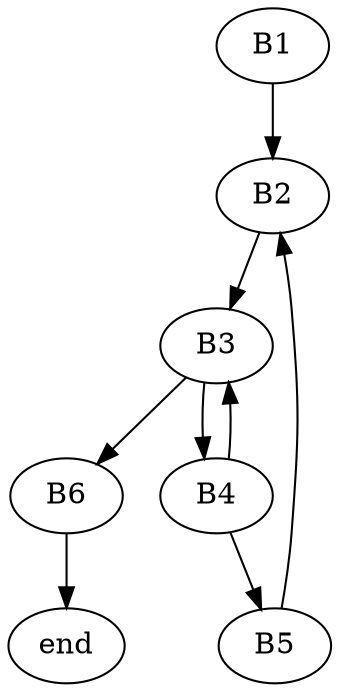
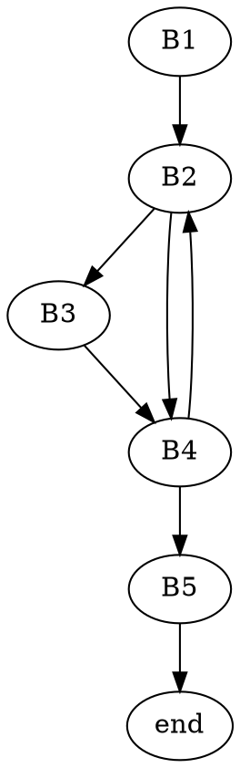
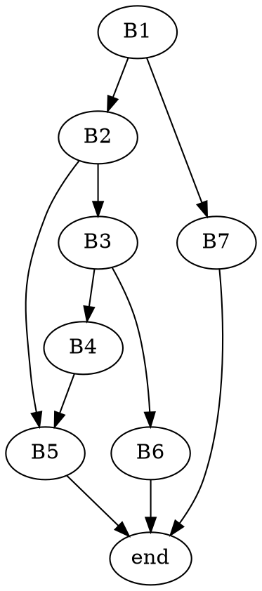

# ASK - LISTA 5

## 1
### Objaśnienie
n <= 64

puzzle(long x, unsigned n)
long - q
unsigned - l

x - %edi (%rdi)
n - %esi (%rsi)
wynik - %eax (%rax)

temp = %ecx
```
puzzle: 
     testl %esi, %esi   // n:n 
     je    .L4          // (n==0) -> skocz do .L4
     xorl  %edx, %edx   // wyzeruj edx
     xorl  %eax, %eax   // wyzeruj eax (wynikowy)
.L3: movl  %edi, %ecx   // przenosi x do temp
     andl  $1, %ecx     // temp <- temp & 1
     addl  %ecx, %eax   // eax <- eax + temp
     sarq  %rdi         // x >> 1 (arith)
     incl  %edx         // edx <- edx + 1
     cmpl  %edx, %esi   // n:edx 
     jne   .L3          // (n-edx!=0) -> skocz do .L3
     ret
.L4: movl  %esi, %eax   // eax = n
     ret
```
### Kod w C
```c=
int puzzle(long x, unsigned n)
{
    int result = 0;             // eax
    for(int i = 0; i != n; ++i) // i == edx
    {
        result += (x & 1);
        x >>= 1 ;
    }
    return result;
}
```
### Co robi
Liczy ile jest zapalonych bitów wśród n najmniej znaczących.
## 2
long puzzle2(char *s, char *d)

### przepływ sterowania
```
puzzle2:
        movq  %rdi, %rax        // B1
.L3:    movb  (%rax), %r9b      // B2
        leaq  1(%rax), %r8      
        movq  %rsi, %rdx        
.L2:    movb  (%rdx), %cl       // B3
        incq  %rdx              
        testb %cl, %cl         
        je    .L4               
        cmpb  %cl, %r9b         // B4
        jne   .L2               
        movq  %r8, %rax         // B5
        jmp   .L3
.L4     subq  %rdi, %rax        // B6
        ret
```
### graf przepływu:


### przetłumaczenie
*s - %rdi
*d - %rsi
wynik - %rax

%r9 - temp
%r8 - next
%rdx - rand
```
puzzle2:
        movq  %rdi, %rax        // result = s 
.L3:    movb  (%rax), %r9b      // char temp = *result
        leaq  1(%rax), %r8      // next = (s+1) - adres
        movq  %rsi, %rdx        // rand = d
.L2:    movb  (%rdx), %cl       // char temp2 = *rand, cl(rcx)
        incq  %rdx              // rand += 1
        testb %cl, %cl         
        je    .L4               // temp2 == 0
        cmpb  %cl, %r9b         // temp-temp2
        jne   .L2               // temp != temp2
        movq  %r8, %rax         // result = next
        jmp   .L3
.L4     subq  %rdi, %rax        // result -= s
        ret
```
```c=
long puzzle2(char *s, char *d)
{
    char* result = s;
    char temp, temp2;
    char *next, *rand;

L3: 
    temp = *result;
    next = result + 1;
    rand = d;
L2: 
    temp2 = *rand;
    rand += 1;
    if(temp2 == 0)
        goto L4;
    if(temp != temp2)
        goto L2;
    result = next;
    goto L3;
L4: result -= s;
    return result;
}
```

```c=
long puzzle2(char *s, char *d)
{
    char* currentS = s;
    
    while(1)
    {
        char* currentD = d;
        char  currentDVal;
        do
        {            
            currentDVal = *currentD;
            currentD++;
            if(currentDVal == 0)
                return (long)(currentS - s);
        }
        while(*currentS != currentDVal);
        
        currentS++;
    }
}
```


## 3 
uint32_t puzzle3(uint32_t n, uint32_t d)

n - %edi (%rdi)
d - %esi (%rsi)
wynik - %eax (%rax)

%edx = temp
%ecx = p
%r8  = r
```
 puzzle3:
         movl %edi, %edi        // zeruje górne bity rejestru 
         salq $32, %rsi         // d << 32
         movl $32, %edx         // temp = 32
         movl $0x80000000, %ecx // p = 2 ^ 32
         xorl %eax, %eax        // result = 0 (zeruje eax)
.L3      addq %rdi, %rdi        // n += n
         movq %rdi, %r8         // r = n
         subq %rsi, %r8         // r -= d
         js   .L2               // jump if negative (SF = 0) (r < d)
         orl  %ecx, %eax        // result |= p
         movq %r8, %rdi         // n = r
.L2      shrl %ecx              // p >>= 1 // logical
         decl %edx              // temp--
         jne .L3                // jump if ~ZF 
         ret
```
### Bloki
```
 puzzle3:
         movl %edi, %edi        // B1
         salq $32, %rsi         
         movl $32, %edx         
         movl $0x80000000, %ecx 
         xorl %eax, %eax        
.L3      addq %rdi, %rdi        // B2
         movq %rdi, %r8         
         subq %rsi, %r8         
         js   .L2               
         orl  %ecx, %eax        // B3
         movq %r8, %rdi         
.L2      shrl %ecx              // B4
         decl %edx              
         jne .L3                 
         ret                    // B5
```

### graf przepływu:

### Przetłumaczenie

```
 puzzle3:
         movl %edi, %edi        // zeruje górne bity rejestru 
         salq $32, %rsi         // d = d << 32
         movl $32, %edx         // temp = 32
         movl $0x80000000, %ecx // p = 2 ^ 32
         xorl %eax, %eax        // result = 0 (zeruje eax)
.L3      addq %rdi, %rdi        // n += n
         movq %rdi, %r8         // r = n
         subq %rsi, %r8         // r -= d
         js   .L2               // jump if negative (SF = 0) (r < d)
         orl  %ecx, %eax        // result |= p
         movq %r8, %rdi         // n = r
.L2      shrl %ecx              // p >>= 1 // logical
         decl %edx              // temp--
         jne .L3                // jump if ~ZF 
         ret
```

```c=
    uint32_t puzzle3(uint32_t n, uint32_t d)
    {
        int64_t n_reg = n;
        int64_t d_reg = (int64_t)d << 32;
        int32_t temp = 32;
        uint32_t p = 0x80000000;
        int32_t result = 0;
        
        do
        {
            n_reg += n_reg;
            int64_t r = n_reg - d_reg;
            if(r >= 0)
            {
                result |= p;
                n_reg = r;
            }
            p >>= 1;
            --temp;
        }while(temp != 0);
        return result;
    }
```
ale do while na pewno wykona się chociaż raz bo temp to stała
oraz przesuwanie maski i zmniejszanie temp o 1 jest analogiczne

```c=
uint32_t puzzle3(uint32_t n, uint32_t d)
{
    int64_t n_reg = n;
    const uint64_t d_shift = (uint64_t)d << 32;
    uint32_t result = 0;
    
    for(uint32_t mask = 0x80000000; mask != 0; mask >>= 1)
    {
        n_reg <<= 1;
        int64_t r = n_reg - d_shift;
        if(r >= 0)
        {
            result |= mask;
            n_reg = r;
        }
    }
    return result;
}
```
gcc main.c puzzle3.c -Os -S
gcc main.s puzzle3.s -o out
./out
### Co robi
Poczytaj o long division
Liczy $\lfloor n/d \rfloor$

## 4
### przepływ sterowania
Pytanie:
Czy od każdego calla dać do B1 bo to jump do pierwszej linii?

int puzzle4(long *a, long v, uint64_t s, uint64_t e)
```
puzzle4:
        movq %rcx, %rax            // B1            
        subq %rdx, %rax 
        shrq $rax      
        addq %rdx, %rax
        cmpq %rdx, %rcx
        jb   .L5       
        movq (%rdi, %rax, 8), %r8  // B2
        cmpq %rsi, $r8
        je   .L10    
        cmpq %rsi, %r8             // B3
        jg   .L11   
        leaq 1(%rax), %rdx         // B4
        call puzzle4               
.L10    ret                        // B5
.L11    leaq -1(%rax), %rdx        // B6
        call puzzle4               
        ret                        
.L5     movl $-1, %eax             // B7
        ret
        
```

### graf przepływu (TODO)

### przetłumaczenie
int puzzle4(long *a, long v, uint64_t s, uint64_t e)
*a - %rdi
v  - %rsi
s  - %rdx
e  - %rcx
result - %rax
temp - %r8
```
puzzle4:
        movq %rcx, %rax            // result = e
        subq %rdx, %rax            // result -= s
        shrq $rax                  // result >= 1 (logical)
        addq %rdx, %rax            // result += s
        cmpq %rdx, %rcx            // e:s
        jb   .L5                   // e < s -> jump (CF-unsigned)
        movq (%rdi, %rax, 8), %r8  // temp = a[result]
        cmpq %rsi, $r8             // temp:v
        je   .L10                  // temp == v -> jump if equal/zero (ZF)
        cmpq %rsi, %r8             // temp:v
        jg   .L11                  // (temp > v) -> jump if greater (signed - ~(SF^OF)&~ZF)
        leaq 1(%rax), %rdx         // s = result + 1
        call puzzle4               // puzzle4(a,v,s,e)
.L10    ret
.L11    leaq -1(%rax), %rcx        // e = result - 1
        call puzzle4               // puzzle4(a,v,s,e)
        ret
.L5     movl $-1, %eax             // result = -1
        ret
        
```

```c=
int puzzle4(long *a, long v, uint64_t s, uint64_t e)
{
    uint64_t result = ((e - s) >> 1) + s;
    if(e >= s)
    {
        long temp = a[result];
        if(temp == v)
        {
            return result;
        }
        if(temp > v)
        {
            e = result - 1;
            return puzzle4(a,v,s,e);
        }
        
        s = result + 1;
        return puzzle4(a,v,s,e);
    }
    return -1;
}
```
upraszczając
```c=
int puzzle4(long *a, long v, uint64_t s, uint64_t e)
{
    uint64_t position = ((e - s) >> 1) + s;
    if(e >= s)
    {
        long midValue = a[position];
        if(midValue == v)
            return position;
        else if(midValue > v)
            e = position - 1;        
        else
            s = position + 1;    
    
        return puzzle4(a,v,s,e);
    }
    return -1;
}
```
### co robi
Wyszukuje pozycję wartości $v$ w posortowanej tablicy longów $a$, przy pomocy wyszukiwania binarnego. $s$-początek przedziału wyszukiwania, $e$ - koniec.

## 5
long switch_prob(long x, long n)
### Przetłumaczenie

Zrzut pamięci:
(gdb) x/6gx 0x4006f8

x - examine memory
6 - sześć kolejnych
g - giant word - 8 bajtów
x - w formacie hex
```
0x4006f8:    0x4005a1    // 0
0x400700:    0x4005a1    // 1
0x400708:    0x4005b2    // 2
0x400710:    0x4005c3    // 3
0x400718:    0x4005aa    // 4
0x400720:    0x4005bf    // 5
```
x - %rdi
n  - %rsi
result - %rax

```
400590 <switch_prob>:
400590:  subq  $0x3c,%rsi         // n -= 0x3c (60)
400594:  cmpq  $0x5,%rsi          // n:0x5
400598:  ja    *0x4005c3          // (n < 5) -> jump to line (default) (CF = 0, ZF = 0)
40059a:  jmpq  *0x4006f8(,%rsi,8) // jump to line in %rsi * 8 + 0x4006f8 
4005a1:  lea   0x0(,%rdi,8),%rax  // result = 8 * x
4005a9:  retq 
4005aa:  movq  %rdi,%rax          // result = x
4005ad:  sarq  $0x3,%rax          // result >>= 3 (arithmetic)
4005b1:  retq
4005b2:  movq  %rdi,%rax          // result = x
4005b5:  shlq  $0x4,%rax          // result <<= 4 (logical)
4005b9:  subq  %rdi,%rax          // result -= x
4005bc:  movq  %rax,%rdi          // x = result
4005bf:  imulq %rdi,%rdi          // x = x * x -> signed multiply result on destination
4005c3:  leaq  0x4b(%rdi),%rax    // result = x + 0x4b (75)
4005c7:  retq
```

```c=
long switch_prob(long x, long n)
{
    n -= 0x3c;    // 60
    switch(n)
    {
        case 0:
            return 8 * x;
        case 1:
            return 8 * x;
        case 2:
            return ((x << 4) - x) * ((x << 4) - x) + 0x4b;
        case 3:
            return x + 0x4b;
        case 4:
            return x >> 3;
        case 5:
            return x * x + 0x4b;
        default:
            return x + 0x4b;
    }
}
```
(x << 4) - x == x * 16 - x
```c=
long switch_prob(long x, long n)
{
    switch(n)
    {
        case 60:
        case 61:
            return 8 * x;
        case 64:
            return x >> 3;
        case 62:
            x = 15 * x; 
        case 65:
            x = x * x;
        default:
            return x + 0x4b;
    }
}
```